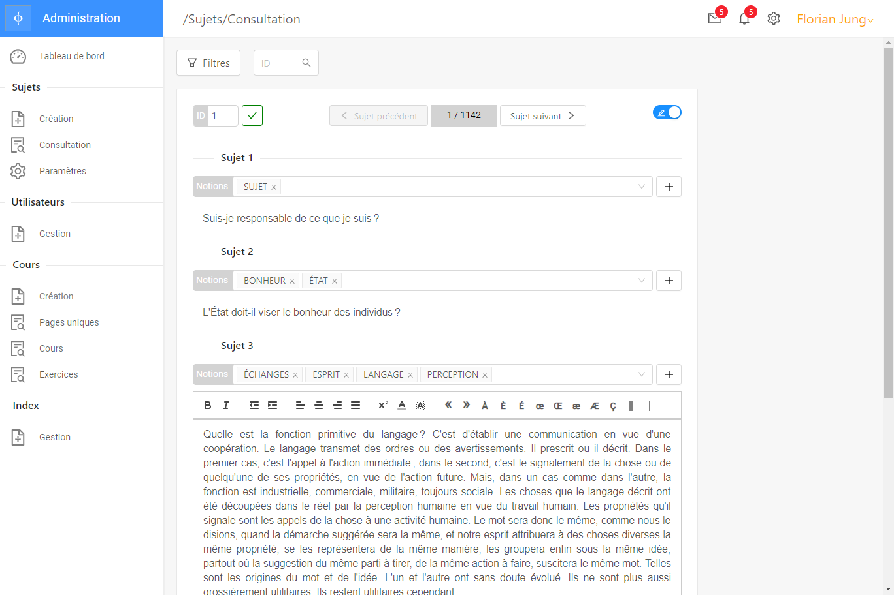
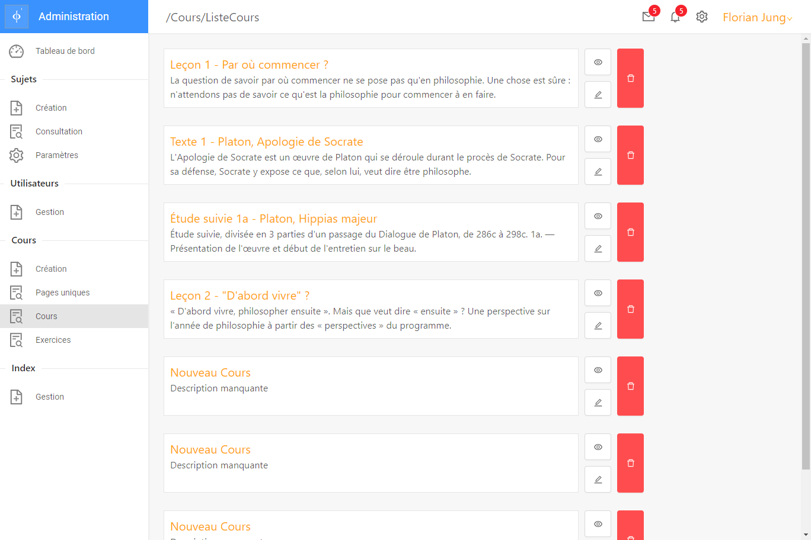
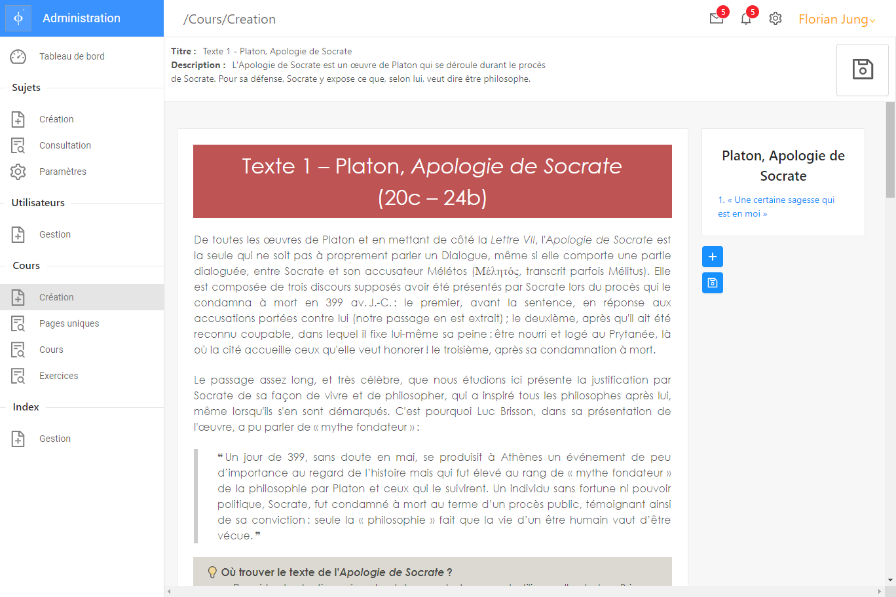
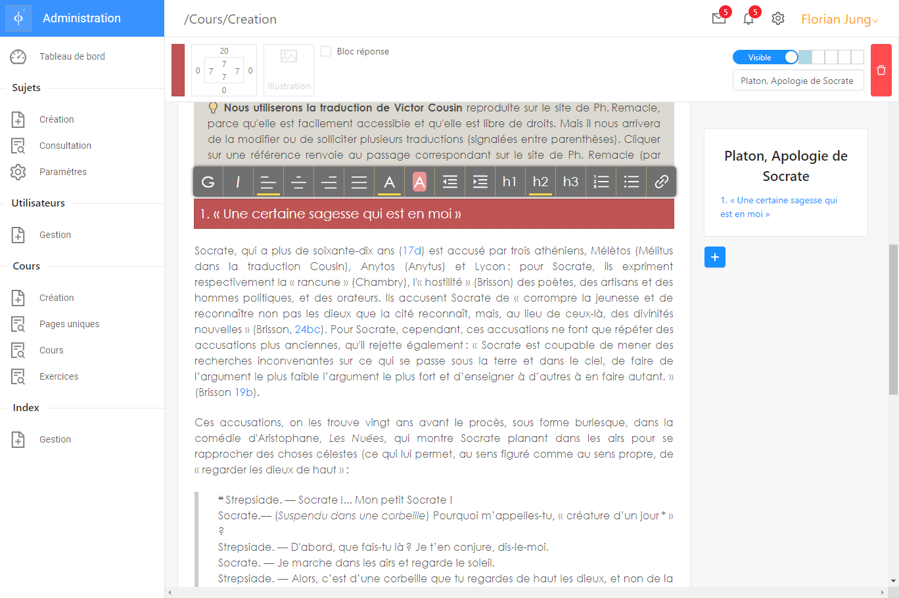

<h1 align="center">PhidAdmin</h1>

CRM / Gestion de Phidbac.fr

PhidAdmin est une interface d'administration pour le site <a href="https://github.com/guarn//phidbac-nextjs">Phidbac.fr</a>. La partie backend eest géré par un serveur express et une base Postgres.  
Elle permet de gérer avec facilité les rubriques suivantes :

## Annales du bac

Gestion complète des sujets de bac (textes, notions abordées, données de publication), avec un mode prévisualisation simulant le rendu sur la page officielle.

## Création d'un Cours

Interface de gestion des cours existants et de ler ordre d'apparition sur le site, géré par dragndrop.

## Editeur de texte

Utilisé pour les sujets, exercices, et index.

Editeur de texte complet incluant (liste non exhaustive) :
- Gestion de padding et margin et d'une couelur de fond
- Sommaire avec scroll automatique repoduit à la publication sur le site, de 
- liens améliorés (choix de l'ouverture par popup, nouvelle page,etc...) vers les notions, sujets, blocs de sujets d'une autre partie du site automatiquement

 

